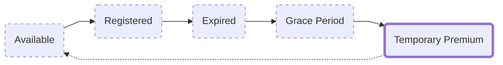

---
last_update:
  date: 12/08/2022
  author: cthulu
tags:
  - manager
---

import BrowserWindow from '@site/src/components/BrowserWindow';
import Image from '@theme/IdealImage'
import Link from '@docusaurus/Link';

# Temporary Premium
90 days after an ENS name has expired, when it exits the `Grace Period` it will go into a `Temporary Premium Auction`

This is a public auction where anyone can buy the name with a `Temporary Premium Fee` attached to it that lasts for 21 days.

## Temporary Premium Fee
The Temporary Premium Fee starts at $100 million and declines *exponentially* to $0 over the course of the 21 days.

### Why would anyone pay $100m for an ENS name?
The starting price of the `Temporary Premium Fee` was never intended to be one that anyone actually pays for a name. It was chosen to intentionally be out of reach so that names couldn't be instantly bought.

## Why have a Temporary Premium Auction in the first place?
The Temporary Premium Auction is an attempt at solving a problem we've had with ENS names. Where bots or traders would *instantly* snipe any expiring name hoping to flip them quickly.

These bots and traders would sometimes pay thousands of dollars *in gas fees alone* to make sure they got the name first.
