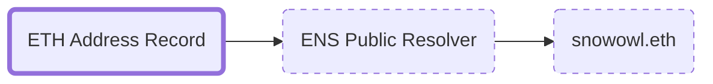

import BrowserWindow from '@site/src/components/BrowserWindow';
import Image from '@theme/IdealImage';
import Link from '@docusaurus/Link';

# The ETH Address record

## What does it do?
The `ETH` Address record is one of the main records of your ENS name. It determines where Ethereum funds sent to it ends up, as well as providing the `forward resolution` required when setting up a <Link to="/docs/records/primary-name"><b>Primary name</b></Link>.

If you find that an ENS name you own doesn't show up in the Primary Name drop-down list for your wallet, it's usually because the `ETH Address` record isn't set to it.

:::info summary
The ETH Address record...
 - Determines to where funds sent to the ENS name ends up
 - Provides the `Forward resolution` required to set a `Primary name` in a wallet 
:::

:::info Resources
To find out how to set the `ETH Address` record or for more information about the Primary Name, see
 - <Link to="/docs/howto/add-wallet-address"><b>How-To: </b>Add a wallet address</Link>
 - <Link to="/docs/core/records/primary-name"><b>Records:</b> Primary Name</Link>
:::

