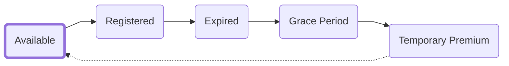
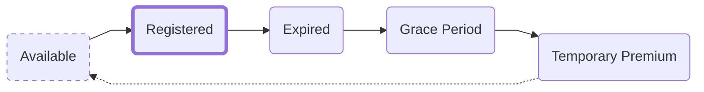
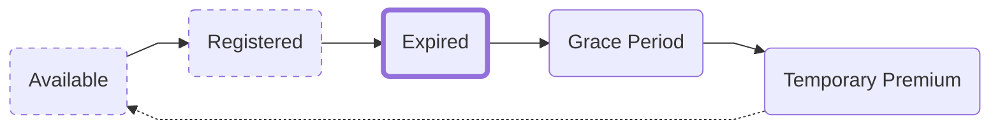
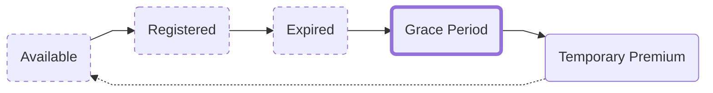
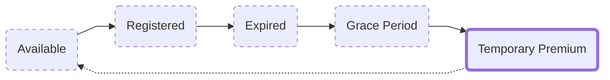

import Link from '@docusaurus/Link';

# The Lifecycle of an ENS Name
ENS names goes through several stages from being available to being registered and expiring. A life cycle of sorts.
This article tries to explain its life cycle in simple terms. As such, the diagrams are simplified.

## Normal availability

:::info Normal availability

If the `Temporary auction` ends without a buyer the ENS name will become available normally again without a temporary fee attached.
:::
## Registered

:::info Registered

:::

<!--
## Registration period
**Registration period** **→** `Expiration` **→** `Grace period` **→** `Premium auction` **→** `Normal availability`  
This is the period of time you've registered the ENS name for.  
After the registration period is over, it will begin the process towards normal availability going through the post-expiration stages.
  
If you want to extend your registration period, this can be done from the [ENS Manager App](https://app.ens.domains) -->
## Expired
:::info Expired

This is when your ENS name expires. After an ENS name has expired, it will still point to your records until it's released. However:
:::
:::caution
An ENS name cannot be sold, transferred, or changed after this point. To regain control of it you must extend the registration period.
:::

## Grace period
:::info Grace Period

After an ENS name expires it enters into what's called a *Grace period*. This is a 90-day window provided as a courtesy where the owner can renew it and keep it at the regular renewal cost.
:::
:::note
Keep in mind that the renewal period must be from when the name expired, otherwise the grace period will just be moved up.

For example, if a name expired 60 days ago, and you only extend the registration for 30 days, then the name will *still* be expired, and the end of the grace period will just be extended for 30 days.
:::

## Temporary Premium Auction
:::info Temporary Premium Auction

After the grace period ends the ENS name will enter into a `Temporary Premium Auction`.
This is a 21-day period where the ENS name is available for anyone to register with a temporary premium attached.

For more information about the Temporary Premium Auction and the Temporary Premium Fee, see
 - <Link to="/docs/core/registration/temporary-premium"><b>Registration: </b> Temporary Premium Auction</Link>
:::

