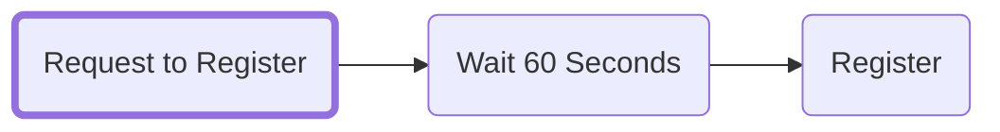
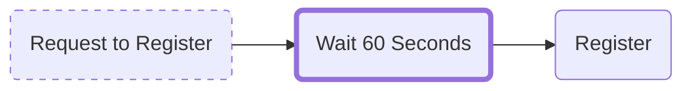
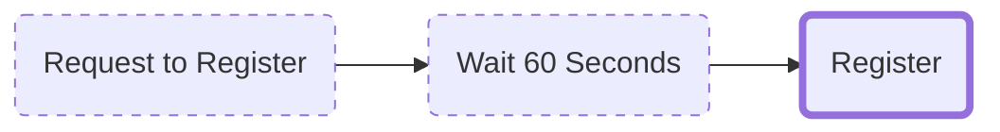

---
last_update:
  author: cthulu
tags:
  - registration
  - step
  - commit
  - request to register
keywords: [registration, steps, commit, request to register, registration transaction, register transaction, ens registration, ens register, ens register a name, ens name registration, name registration, ens registration, get your own ens, get your own ens name]
description: Information on the Registration Steps
---

# Registration Steps

There are three steps involved in registering an ENS name that is intended to mitigate the problem of front-running.

Front-running an ENS name would be possible if registration happened in one transaction.
Someone could “see” the single registration transaction in the mempool, and send the same transaction but with higher gas so the transaction they sent settles first.

In essence, “sniping” the name before registration completes. For this reason, ENS name registrations rely on a `Reveal-Committment Scheme`.

:::info Learning Resource
For a step on step guide on registering a name, see
 - <Link to="/docs/howto/registration"><b>How-To: </b>Register a Name</Link>
:::

## Step 1: Request to register

The commit in Step 1 hashes a secret key generated and stored in your browser's local storage and hashes it with your wallet address and ENS name so that you can later register it without revealing it publicly.

Only the user knows the values of the cryptographic hash.

Once you've performed the `Request to Register` you have 7 days to complete Step 3 until the `Request to Register` becomes invalid.
:::info
No registration fees are collected in this step. The fees are only for gas to save the commit transaction on-chain.
:::

:::caution
 - Keep in mind that while you have 7 days to complete the name registration, the name is ***not*** reserved for you during this time.
 - Clearing your browser cache will lose the saved commit, and start the registration process over again.
:::

<!--

<BrowserWindow url="app.ens.domains">
  <Image img="/img/registration_3steps_img1.webp"/>
</BrowserWindow>

-->

## Step 2: Wait for 1 minute

A 1 minute waiting period begins to prevent the front-running of the ENS name registration. This wait period acts as a “buffer” so that in the final step, the revealed ENS name’s registration cannot be front-run with a higher gas transaction.

<!--

<BrowserWindow url="app.ens.domains">
  <Image img="/img/registration_3steps_img2.webp"/>
</BrowserWindow>

-->

## Step 3: Register

The ENS name registration is revealed on-chain. Once the registration transaction is performed and the ENS name is registered; the ERC-721 NFT for the ENS name is minted and transferred into the owner's wallet.

<!--

<BrowserWindow url="app.ens.domains">
  <Image img="/img/registration_3steps_img3.webp"/>
</BrowserWindow>

-->

## In conclusion
If a miner wanted to try and front-run this process, they would have to send their own hashed secret, wait 1 minute and then register the name. Since The 3 step registration process works because they can't hold back your transaction for one minute, they will fail to do so, and the miner can't use the secret compared to the earlier hash.