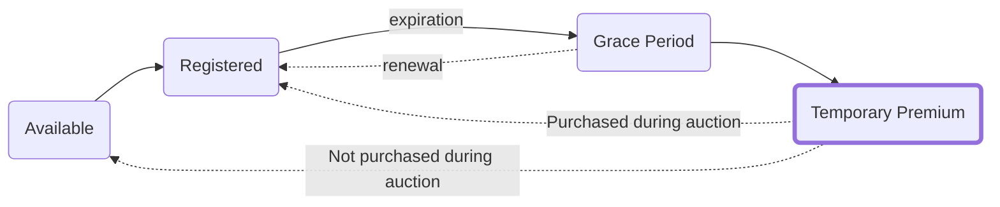

---
last_update:
  date: 01/06/2023
  author: cthulu
tags:
  - manager
description: What is a Temporary Premium Auction?
---

# Temporary Premium
90 days after an ENS name has expired, when it exits the `Grace Period` it will go into a `Temporary Premium Auction`.

This is a public auction where anyone can buy the name with a `Temporary Premium Fee` attached to it that lasts for 21 days.

## Temporary Premium Fee
The Temporary Premium Fee starts at $100 million and declines *exponentially* to $0 over the course of the 21 days.

## Why would anyone pay $100m for an ENS name?
The starting price of the `Temporary Premium Fee` was never intended to be one that anyone actually pays for a name. It was chosen to intentionally be out of reach so that names couldn't be instantly bought.

## Why have a Temporary Premium Auction in the first place?
The Temporary Premium Auction is an attempt at solving a problem we've had with ENS names. Where bots or traders would *instantly* snipe any expiring name.
The bots and traders would sometimes pay thousands of dollars *in gas fees alone* and up to $10k for the name itself just to make sure they got the name first.

This caused a situation where users who didn't use bots were never even to able see or interact with the website before the name had been bought.
Having a start price for the `Temporary Premium Auction` that's far higher than what anyone would be willing to pay ensures that this doesn't happen again.

## What happens if no one buys the name?
If no one buys the name during the 21 days the `temporary premium auction` is active, the `temporary premium fee` will become $0 and the name will become available at normal registation fees again.

:::info Resources
View the related governance proposal:
 - <Link to="https://docs.ens.domains/v/governance/governance-proposals/term-1/ep9-executable-change-to-exponential-premium-price-oracle"><b>Change to Exponential Premium Oracle</b></Link>