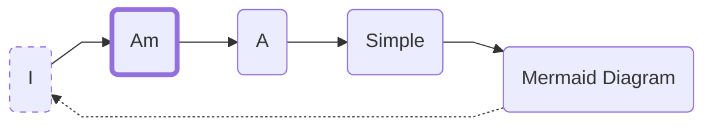

---
last_update:
  author: cthulu
tags:
  - contribution
  - contributor guidelines
  - guidelines
---

# Contributor Guidelines

## Changes
:::info
- If the changes are *objective* *(i.e. correcting spelling mistakes, punctuation, code mistakes etc)* they can be PR’ed without prior discussion
- If the changes are *subjective* *(i.e. changing a confusing sentence to another one)* post about it and your suggested change in the User Docs Chat so we can brainstorm it and come to a consensus before the PR
:::

## Formatting
:::info
 - All articles should be in the `MDX` file format and written by hand *(as opposed to using a WYSIWYG-tool)*
 since they produce results that are difficult to work with.
   - [**Docusaurus:** How to Create a Doc](https://docusaurus.io/docs/create-doc)
   - [**Docusaurus:** Markdown Features](https://docusaurus.io/docs/markdown-features)
 - Code blocks should use the correct type to make use of syntax highlighting where possible, for example:  
    
    **This is a codeblock without syntax highlighting enabled**
    ```
    // Code block without syntax highlighting
    console.log('Hello World');
    ```

    **And here it is with syntax highlighting enabled**
    ```js
    // Code block with syntax highlighting
    console.log('Hello World');
    ```
 - Keep in mind to double space where needed.
 - Word wrapping must be turned off in your editor for the site generator to produce the expected results.

:::

## Arrows & Indicators
:::info
 - We use [Flameshot](https://flameshot.org) as the official tool to capture screenshots and add arrows, indicators etc.
 - Use colour: `#ff6500` for arrows and indicators and a thickness of `30%`  
  <ImageWindow title="Example arrow">
  <p align="center">

  <Image img="/img/contributor-guidelines-arrow.png"/>

  </p>
  </ImageWindow>

:::

## Diagrams
:::info
 - Diagrams should be in `Mermaid` code where possible, for example:



is generated using this code:

```js
%%{
  init: {
    'flowchart': {
      'curve': 'linear'
      } } }%%
      
graph LR;
A(I);
B(Am);
C(A);
D(Simple);
E(Mermaid Diagram);

classDef active stroke-width:4px;
classDef inactive stroke-dasharray: 5 5;

class A inactive;
class B active;

A-->B-->C-->D-->E;
E -.-> A;
```

:::

## Images
:::info
 - Images should be in the `PNG` file format and at least `1024x768` large if used within a browser component
 - For the V3 Manager App's small widgets submit images of it with the background cut out in an alpha-layer enabled PNG. For example:
  <ImageWindow title="Remove the background and make sure that the background layer is an alpha-layer">
  <p align="center">

  
  
  </p>
  </ImageWindow>
 - For any images used outside of a browser component there should be dark and light versions (for theme switching)
 - Prefix the name of your article to any images associated with it. For example: If your article is named **ens-names.mdx** then name images associated with it **“ens-names-description”**.

This helps keep the static image folder structure easy to navigate.
*(In the near future, all images will be moved into sub-folders of articles to remove this requirement, currently this folder structure exists to make batch image compression fine tuning simpler)*

:::

## Git PR process

:::info
- Direct commits are not allowed, make sure to commit your files from a branch descriptive of your changes, such as bugfix-1, patch-1, etc.
- If the changes are minor, consider bundling them into a larger commit to avoid PR overload (there’s no need for one PR per spelling error per page)
- Ensure that your changes are staged properly, and commits accurately describe their changes (i.e. don’t commit “adding images” with 4 images attached, but also an unrelated code fix)
:::