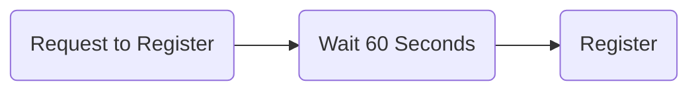
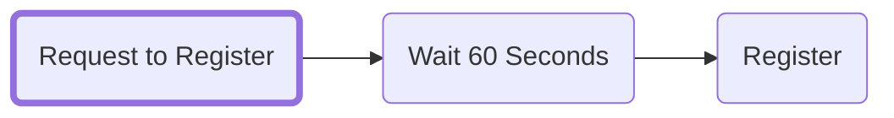
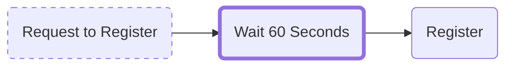
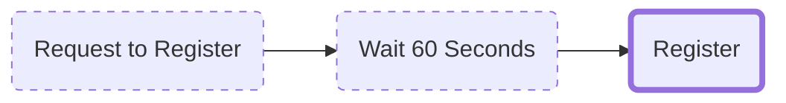

import Tabs from '@theme/Tabs';
import TabItem from '@theme/TabItem';

# How to register a name (V3)

## Go to the ENS Manager App
Go to the <Link to="https://app.ens.domains"><b>ENS Manager App</b></Link> and connect your wallet.

## Search for the ENS name you want
<BrowserWindow url="app.ens.domains">
  <Image img="/img/howto/v3-register-1.png"/>
</BrowserWindow>
Provided that the name you searched for is available, click on it to continue to the beginning of the registration.

<BrowserWindow url="app.ens.domains">
  <Image img="/img/howto/v3-register-2.png"/>
</BrowserWindow>

Select the amount of years you want to register the name for, and if you'd like to set it as your wallets `Primary name`
during the registration process and then click `Next` 

:::info
For more information about what the `Primary name` does see: <Link to="/docs/core/records/primary-name"><b>Records:</b> Primary Name</Link>
:::

## Set additional records
If you selected to set the `Primary name` during the registration process, expand this section for help
on how to set additional records.

<Tabs>
<TabItem value="General" default>

From this section you can set General records:

:::info General records
 - Nickname
 - Website
 - Location
 - Short Bio
:::

<BrowserWindow url="app.ens.domains">
<Image img="/img/howto/v3-register-cthulu-3.png"/>
</BrowserWindow>
</TabItem>
<TabItem value="Accounts">

From the `Accounts` section you can add accounts with other services, such as:

:::info Accounts
 - Twitter
 - Discord
 - GitHub
:::

<BrowserWindow url="app.ens.domains">
<Image img="/img/howto/v3-register-cthulu-4.png"/>
</BrowserWindow>
<BrowserWindow url="app.ens.domains">
<Image img="/img/howto/v3-register-cthulu-5.png"/>
</BrowserWindow>
</TabItem>
<TabItem value="Address">

From the `Address` section you can add your various wallet addresses.
ENS supports a wide variety of wallet addresses, for more information see:

:::info Core Concepts
 - [**Records:** Coin Types](/docs/core/records/coin-types)
:::

<BrowserWindow url="app.ens.domains">
<Image img="/img/howto/v3-register-cthulu-6.png"/>
</BrowserWindow>
</TabItem>
<TabItem value="Website">

From the `Website` section you can point your ENS name to a decentralized website.
For more information, see:

:::info Learning resources
 - [**Records:** Content Hash](/docs/core/records/content-hash)
 - [**How-To:** Create a Decentralized Website](/docs/howto/decentralized-website)
:::

<BrowserWindow url="app.ens.domains">
<Image img="/img/howto/v3-register-cthulu-7.png"/>
</BrowserWindow>
<BrowserWindow url="app.ens.domains">
<Image img="/img/howto/v3-register-cthulu-8.png"/>
</BrowserWindow>
<BrowserWindow url="app.ens.domains">
<Image img="/img/howto/v3-register-cthulu-9.png"/>
</BrowserWindow>
</TabItem>
<TabItem value="Other">

From the `Other` tab you can set Custom Records and ABI records. For more information, see:

:::info How-To
 - [**Records:** Custom Records](/docs/core/records/custom-records)
 - [**How-To:** Add a Custom Record](/docs/howto/add-custom-record)
:::

<BrowserWindow url="app.ens.domains">
<Image img="/img/howto/v3-register-cthulu-10.png"/>
</BrowserWindow>
</TabItem>
</Tabs>

## Registering your ENS name
Registering an ENS name is a three step process:
:::info Transaction details

 1. `Request to Register`  
 *A 0ETH commit transaction to prevent front-running*
   
 1. `Wait 60 Seconds`  
 *A 60 second waiting time*
   
 1. `Register`  
 *The actual Registration transaction*
:::

### Step 1: Request to register

Click `Request to Register` to start **Step 1** of the registration process.
A 0 ETH transaction is performed where your name is hashed with a secret key so that no one else can view the name you're trying to register.

:::info
While this transaction does not have a transaction value, it still incurs a gas fee.
:::

:::caution
* This step stores a *secret key* in your browser's local storage. To avoid having to repeat this step, make sure to ***not*** clear your cache or switch browsers.

* You have ***7 days*** to complete Step 3 before the `Request to Register` transaction expires. *However,* the ENS name is ***not reserved for you*** during this time.
:::

Double-check that the registration length and fees are satisfactory, then press `Begin` to start the registration process.
<BrowserWindow url="app.ens.domains">
  <Image img="/img/howto/v3-register-cthulu-11.png"/>
</BrowserWindow>

Click `Open wallet` and approve the transaction in your wallet.
<BrowserWindow url="app.ens.domains">
  <Image img="/img/howto/v3-register-cthulu-12.png"/>
</BrowserWindow>

Wait while the transaction is processed by the Ethereum blockchain.
<BrowserWindow url="app.ens.domains">
  <Image img="/img/howto/v3-register-cthulu-13.png"/>
</BrowserWindow>

### Step 2: Wait 60 seconds

After the Step 1 transaction completes there's a 60-second waiting period to prevent front running.
<BrowserWindow url="app.ens.domains">
  <Image img="/img/howto/v3-register-cthulu-14.png"/>
</BrowserWindow>
<BrowserWindow url="app.ens.domains">
  <Image img="/img/howto/v3-register-cthulu-15.png"/>
</BrowserWindow>

### Step 3: Register

Now it's time to `Register` your ENS name. Click the register button and confirm the transaction in your wallet.
<BrowserWindow url="app.ens.domains">
  <Image img="/img/howto/v3-register-cthulu-16.png"/>
</BrowserWindow>
<BrowserWindow url="app.ens.domains">
  <Image img="/img/howto/v3-register-cthulu-17.png"/>
</BrowserWindow>

Congratulations! If all transactions went through successfully you should now be the proud owner of your very own ENS name!
<BrowserWindow url="app.ens.domains">
  <Image img="/img/howto/v3-register-cthulu-18.png"/>
</BrowserWindow>