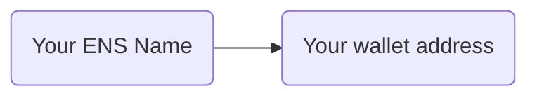

# The Primary name

## How name resolution works

The Primary name is your reverse record responsible for resolving your wallet address to your ENS name, effectively helping DApps and other services display your ENS name based on your wallet address.

The easiest way to understand it is to consider that name resolution works in two directions:

### Forward resolution

Forward resolution is simply where your name points to and is determined by the `ETH Address` record set on your ENS name.

### Reverse resolution

Reverse resolution is where your wallet points to and is determined by the `Primary name` record set in your wallet.

## Set the Primary record

To set your ENS name as Primary in your wallet:

1. Make sure the `ETH Address` record points to the wallet address

1. Connect your wallet to the [ENS Manager App](https://app.ens.domains) and set the ENS name as `Primary`.
