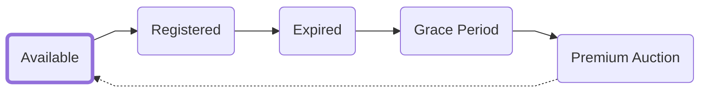
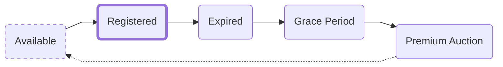
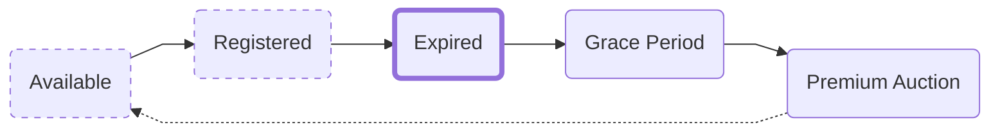
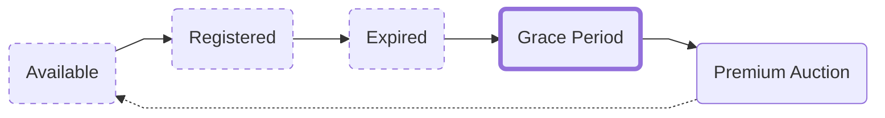
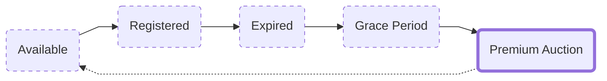

# The Lifecycle of an ENS Name
<!--
## Registration period
**Registration period** **→** `Expiration` **→** `Grace period` **→** `Premium auction` **→** `Normal availability`  
This is the period of time you've registered the ENS name for.  
After the registration period is over, it will begin the process towards normal availability going through the post-expiration stages.
  
If you want to extend your registration period, this can be done from the [ENS Manager App](https://app.ens.domains) -->

## Normal availability

If the `Premium auction` ends without a buyer the ENS name will become available normally again without a premium fee attached.

## Registered

## Expired

This is when your ENS name expires. After an ENS name has expired, it will still point to your records until it's released. However:

:::caution
An ENS name cannot be sold, transferred, or changed after this point. To regain control of it you must extend the registration period.
:::

## Grace period

After an ENS name expires it enters into what's called a *Grace period*. This is a 90-day window provided as a courtesy where the owner can renew it and keep it at the regular renewal cost.

:::note
Keep in mind that the renewal period must be from when the name expired, otherwise the grace period will just be moved up.
:::

## Premium auction

After the grace period ends the ENS name will enter into what's called a `premium auction`.
This is a 21-day period where the ENS name is available for anyone to register with a price premium attached.

The price premium attached starts at $100 million and declines exponentially to $0 over the 21 days.

# Why have a premium auction?
The premium auction was conceived of as a way to prevent ENS names from being sniped by bots immediately when they expired, which was initially a significant problem.
