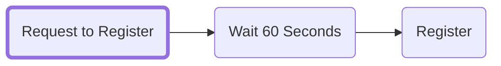
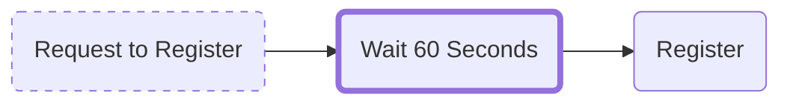
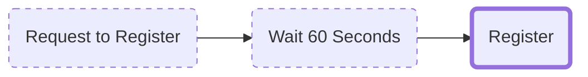

import BrowserWindow from '@site/src/components/BrowserWindow';
import Image from '@theme/IdealImage';

# Registration steps

There are three steps involved in registering an ENS name that is intended to solve the problem of front-running.

## Step 1: Request to register

The commit in Step 1 hashes a secret key generated and stored in your browser's local storage and hashes it with your wallet address and ENS name so that you can later register it without revealing it publicly.

Once you've performed the `Request to Register` you have 7 days to complete Step 3 until the `Request to Register` becomes invalid.

:::caution
Keep in mind that while you have 7 days to complete the name registration, the name is ***not*** reserved for you during this time.
:::

<BrowserWindow url="app.ens.domains">
  <Image img="/img/registration_3steps_img1.webp"/>
</BrowserWindow>

## Step 2: Wait for 1 minute

A 1 minute waiting period begins to prevent the front-running of the ENS name registration.
<BrowserWindow url="app.ens.domains">
  <Image img="/img/registration_3steps_img2.webp"/>
</BrowserWindow>

## Step 3: Register

The registration transaction is performed and the ENS name is registered; the ERC-721 NFT for the ENS name is minted and transferred into the registrant's wallet.
<BrowserWindow url="app.ens.domains">
  <Image img="/img/registration_3steps_img3.webp"/>
</BrowserWindow>

## In conclusion
If a miner wanted to try and front-run this process, they would have to send their own hashed secret, wait 1 minute and then register the name. Since they can't hold back your transaction for one minute, they will fail to do so, and the miner can't use the secret compared to the earlier hash.
