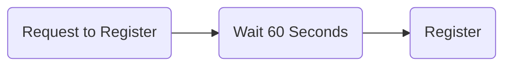
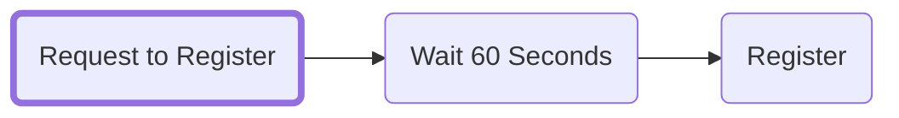
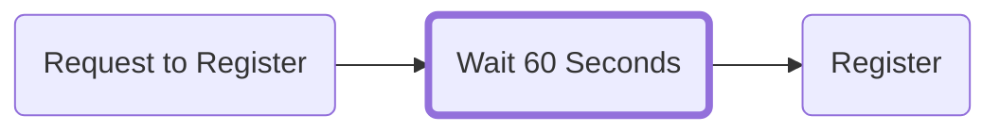
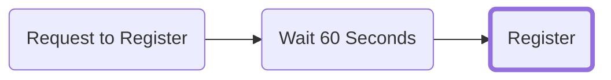

import BrowserWindow from '@site/src/components/BrowserWindow';
import Image from '@theme/IdealImage';

# How to register a name

## Go to the ENS Manager App
Go to the [ENS Manager App](https://app.ens.domains) and connect your wallet.

## Search for the ENS name you want
<BrowserWindow>
  <Image img="/img/register_name_img3.webp"/>
</BrowserWindow>

Provided that the name you searched for is available, click on it to continue to the registration.
<BrowserWindow>
  <Image img="/img/register_name_img4.webp"/>
</BrowserWindow>

## Registering your ENS name
Registering an ENS name is a three step process:

| Transaction           | Details                                             |
| --------------------- | --------------------------------------------------- |
| `Request to Register` | *A 0ETH commit transaction to prevent frontrunning* |
| `Wait 60 seconds`     | *A 60 second waiting time*                          |
| `Register`            | *The actual registration transaction*               |

### Step 1: Request to register

Click `Request to Register` to start **Step 1** of the registration process.
A 0 ETH transaction is performed where your name is hashed with a secret key so that no one else can view the name you're trying to register.

:::info
While this transaction does not have a transaction value, it still incurs a gas fee.
:::

:::caution
* This step stores a *secret key* in your browser's local storage. To avoid having to repeat this step, make sure to ***not*** clear your cache or switch browsers.

* You have ***7 days*** to complete Step 3 before the `Request to Register` transaction expires. *However,* the ENS name is ***not reserved for you*** during this time.
:::

<BrowserWindow>
  <Image img="/img/register_name_img5.webp"/>
</BrowserWindow>

Verify that the cost of the transaction is what you expect it to be and confirm the transaction in your wallet.

### Step 2: Wait 60 seconds

After the Step 1 transaction completes there's a 60-second waiting period to prevent front running.
<BrowserWindow>
  <Image img="/img/register_name_img6.webp"/>
</BrowserWindow>

### Step 3: Register

Now it's time to `Register` your ENS name. Click the register button and confirm the transaction in your wallet.
<BrowserWindow>
  <Image img="/img/register_name_img7.webp"/>
</BrowserWindow>

Congratulations! If all transactions went through successfully you should now be the proud owner of your very own ENS name!
<BrowserWindow>
  <Image img="/img/register_name_img8.webp"/>
</BrowserWindow>
